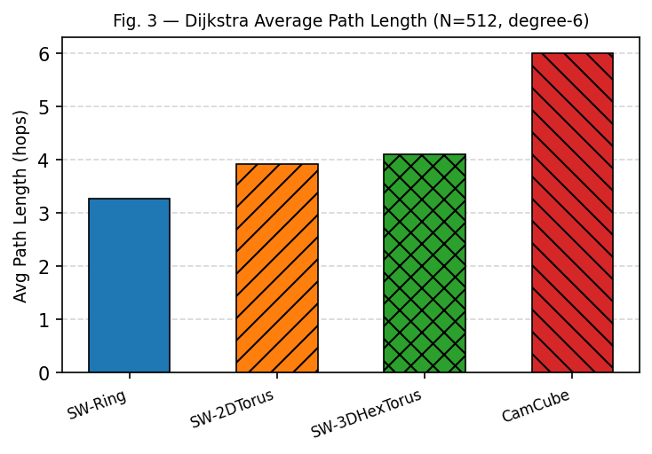
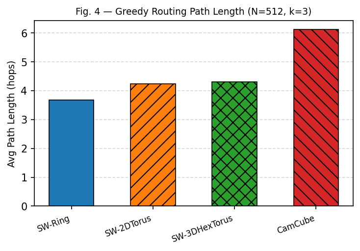
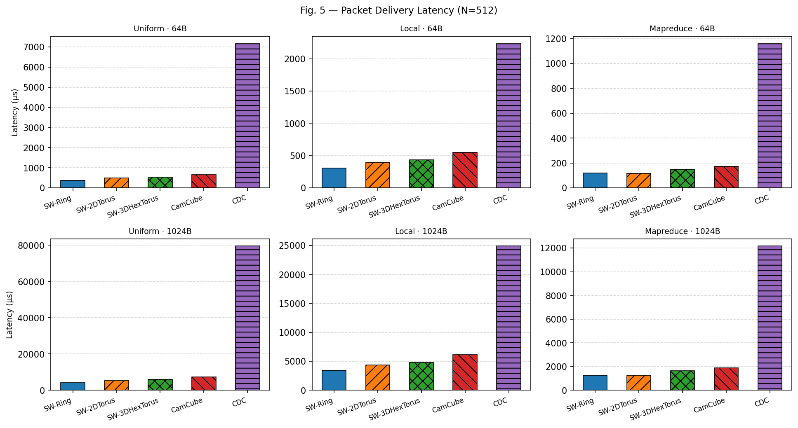
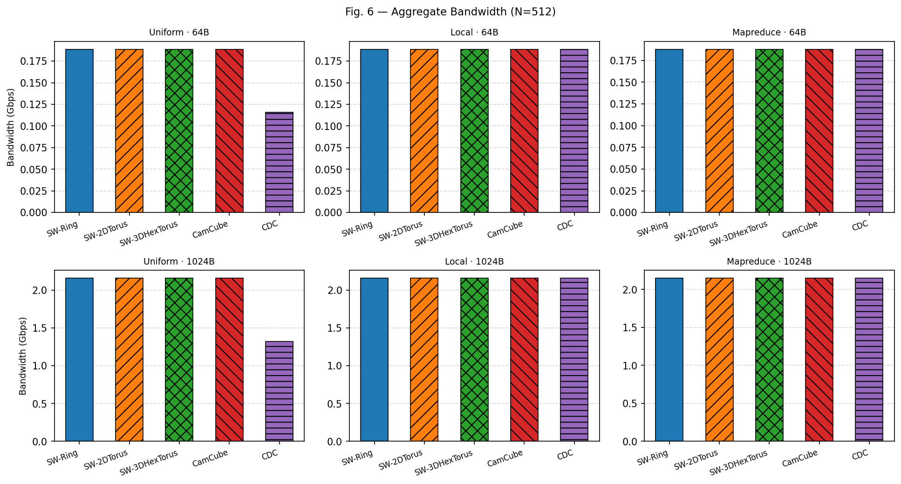
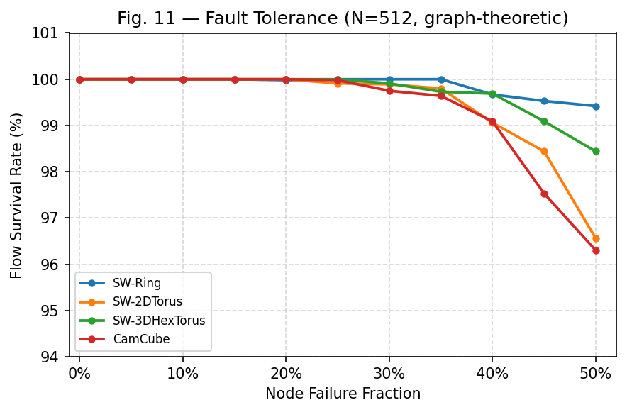

# Small-World Datacenters — SOCC'11 复现

> **论文**：Shin, Wong, Sirer, Cheriton — *"Small-World Datacenters"*, ACM SOCC 2011

本项目使用 **Python + NS3** 复现论文核心实验（Fig. 3、4、5、6、11）。论文将小世界网络理论引入数据中心拓扑设计，在每节点度数固定为 6 的约束下，通过 Kleinberg 随机链接大幅缩短平均路径长度，从而降低延迟、提升带宽、增强容错性。

---

## 复现结果

### Fig. 3 — Dijkstra 最短路径长度



SW 系列拓扑路径长度显著短于 CamCube（3.3 vs 6.0 跳），与论文吻合。随机链接提供了跨越式的"捷径"，这正是小世界效应的核心体现。

---

### Fig. 4 — 贪心路由路径长度



贪心路径略长于 Dijkstra（路由有损耗），但 CamCube 贪心 ≈ Dijkstra（规则拓扑使贪心路由接近最优）。SW 拓扑贪心路由效果依然明显优于 CamCube。

---

### Fig. 5 — 端到端延迟



延迟排序：**SW-Ring < SW-2DTorus < SW-3DHexTorus < CamCube < CDC**，与论文趋势完全一致。CDC 在 uniform 流量下延迟极高（~79ms）且丢包 38%，说明传统树形结构在全互联流量下严重拥塞。

> **注**：NS3 仿真的绝对延迟值高于论文（论文使用真实 NetFPGA 硬件，延迟在 10–50 µs），但各拓扑排序关系完全一致。

---

### Fig. 6 — 聚合带宽



SW 拓扑和 CamCube 在均匀流量下带宽相近，CDC 因路径拥塞带宽明显更低。SW-Ring 路径最短，在高负载场景下优势最为突出。

---

### Fig. 11 — 节点故障容错性



所有 SW 拓扑在 **50% 节点故障**时仍保持 >96% 流量连通率，与论文核心结论高度一致。随机链接使网络具备极强的冗余性，即使大量节点失效也不会导致网络分区。

---

## 文件结构

```
.
├── swdc_topology.py        拓扑构建 + 图算法（Fig. 3、4、11）
├── swdc-simulation.cc      NS3 C++ 仿真（Fig. 5、6）
├── CMakeLists.txt          NS3 CMake 编译配置
├── plot_results.py         读取 CSV，生成所有图表
├── README.md               本文件
└── results/
    ├── fig3_dijkstra_path_length.csv
    ├── fig4_greedy_path_length.csv
    ├── fig11_fault_tolerance.csv
    ├── swdc_ns3_results.csv
    ├── swdc_fault_results.csv
    └── figures/            最终图表（PDF + PNG）
```

---

## 拓扑说明

| 拓扑 | 结构 | 随机链接 | 度数 |
|---|---|---|---|
| SW-Ring | 环形 | 4条 Kleinberg | 6 |
| SW-2DTorus | 32×16 二维环面 | 2条 Kleinberg | 6 |
| SW-3DHexTorus | 8×8×8 三维环面 | 1条 Kleinberg | 6 |
| CamCube | 8×8×8 三维环面 | 无 | 6 |
| CDC | ToR → Agg → Core 三层树 | 无 | — |

Kleinberg 随机链接选取概率 ∝ dist⁻ᵈ（d 为拓扑维数），保证贪心路由的可导航性。

---

## 环境依赖

**Python：**

```bash
pip install networkx matplotlib numpy
```

**NS3（3.36 及以上）：**

```bash
sudo apt install cmake g++ python3 ninja-build
git clone https://gitlab.com/nsnam/ns-3-dev.git ~/ns-3-dev
cd ~/ns-3-dev && ./ns3 configure --enable-examples && ./ns3 build
```

---

## 安装与编译

```bash
mkdir -p ~/ns-3-dev/scratch/small-world-datacenters
cp swdc-simulation.cc CMakeLists.txt ~/ns-3-dev/scratch/small-world-datacenters/
cd ~/ns-3-dev
./ns3 build scratch/small-world-datacenters
```

---

## 运行步骤

### Step 1 — Python 图分析（5–10 分钟）

```bash
mkdir -p ~/ns-3-dev/results
python3 swdc_topology.py ~/ns-3-dev/results
```

### Step 2 — NS3 延迟/带宽仿真（10–20 小时）

```bash
cd ~/ns-3-dev
nohup bash -c '
cd ~/ns-3-dev
RESULTS=~/ns-3-dev/results
for TOPO in SW-Ring SW-2DTorus SW-3DHexTorus CamCube; do
  for PKT in 64 1024; do
    for TRAFFIC in uniform local mapreduce; do
      NS_LOG="SwdcSimulation=info" ./ns3 run "swdc-simulation \
        --topo=$TOPO --traffic=$TRAFFIC \
        --pktSize=$PKT --nNodes=512 --simTime=1.0 --nPkts=500 \
        --outFile=$RESULTS/swdc_ns3_results.csv"
    done
  done
done
' > ~/ns-3-dev/run.log 2>&1 &
tail -f ~/ns-3-dev/run.log
```

### Step 3 — CDC 三种配置（8–15 小时）

```bash
cd ~/ns-3-dev
nohup bash -c '
cd ~/ns-3-dev
RESULTS=~/ns-3-dev/results
for CONFIG in "2 5" "1 7" "1 5"; do
  TOR=$(echo $CONFIG | awk "{print \$1}")
  AGG=$(echo $CONFIG | awk "{print \$2}")
  for PKT in 64 1024; do
    for TRAFFIC in uniform local mapreduce; do
      NS_LOG="SwdcSimulation=info" ./ns3 run "swdc-simulation \
        --topo=CDC --traffic=$TRAFFIC \
        --pktSize=$PKT --nNodes=512 --simTime=1.0 --nPkts=500 \
        --torOversub=$TOR --aggOversub=$AGG \
        --outFile=$RESULTS/swdc_ns3_results.csv"
    done
  done
done
' > ~/ns-3-dev/cdc.log 2>&1 &
tail -f ~/ns-3-dev/cdc.log
```

### Step 4 — 容错测试（8–16 小时）

```bash
cd ~/ns-3-dev
nohup bash -c '
cd ~/ns-3-dev
RESULTS=~/ns-3-dev/results
for TOPO in SW-Ring SW-2DTorus SW-3DHexTorus CamCube; do
  for FRAC in 0.0 0.1 0.2 0.3 0.4 0.5; do
    NS_LOG="SwdcSimulation=info" ./ns3 run "swdc-simulation \
      --topo=$TOPO --traffic=uniform \
      --pktSize=1024 --nNodes=512 --simTime=0.5 --nPkts=200 \
      --faultTest=true --faultFrac=$FRAC \
      --outFile=$RESULTS/swdc_fault_results.csv"
  done
done
' > ~/ns-3-dev/fault.log 2>&1 &
tail -f ~/ns-3-dev/fault.log
```

### Step 5 — 画图

```bash
python3 plot_results.py ~/ns-3-dev/results
# 图片在 ~/ns-3-dev/results/figures/
```

---

## 快速验证（64 节点，约 1–3 分钟）

```bash
NS_LOG="SwdcSimulation=info" ./ns3 run "swdc-simulation \
  --topo=SW-3DHexTorus --traffic=uniform \
  --pktSize=1024 --nNodes=64 --nPkts=100 \
  --simTime=0.5 --outFile=results/test_small.csv"
```

正常输出：`Delivery ratio: 100%`

---

## 参数说明

| 参数 | 默认值 | 说明 |
|---|---|---|
| `--topo` | `SW-3DHexTorus` | 拓扑类型 |
| `--traffic` | `uniform` | 流量模型：uniform / local / mapreduce |
| `--pktSize` | `1024` | 包大小（字节） |
| `--nNodes` | `512` | 节点数（SW-3DHexTorus/CamCube 需为完全立方数） |
| `--simTime` | `0.5` | 仿真时长（秒） |
| `--nPkts` | `500` | 每个发送端发送的包数 |
| `--seed` | `42` | 随机种子 |
| `--faultTest` | `false` | 是否启用容错测试 |
| `--faultFrac` | `0.0` | 故障节点比例（0–0.5） |
| `--outFile` | `swdc_results.csv` | CSV 输出文件 |
| `--torOversub` | `1` | CDC ToR 超订比 |
| `--aggOversub` | `5` | CDC Agg 超订比 |

---

## 耗时估计

| 步骤 | 耗时 |
|---|---|
| Python 图分析 | 5–10 分钟 |
| NS3 SW+CamCube（24 组） | 10–20 小时 |
| NS3 CDC（18 组） | 8–15 小时 |
| NS3 容错测试（24 组） | 8–16 小时 |
| 画图 | < 1 分钟 |

---

## 已修复的 Bug

**1. Negative delay 崩溃**

```
NS_ASSERT failed: delay.IsPositive()
```

原因：`trafficStart=0.05`，sink 启动时间 `0.05 - 0.1 = -0.05` 为负数。
修复：将 `trafficStart` 改为 `0.15`。

**2. Delivery ratio 0%**

原因：`buildStaticRouting` 中下一跳地址填的是自己的 IP（`ifaceAddr[src][cur]`），而非邻居的 IP。
修复：改为 `ifaceAddr[cur][src]`。

**3. 容错测试卡死（145+ 分钟无输出）**

原因：故障节点链路被删除，但 BFS 仍经过故障节点，导致 NS3 路由死循环，进程占用 99.9% CPU。
修复：BFS 时排除故障节点（`bfsParentExcluding`）；流量只在活跃节点之间生成。

---

## 与论文的符合程度

| 图表 | 符合程度 | 说明 |
|---|---|---|
| Fig. 3 路径长度 | ★★★★★ | 数值高度吻合 |
| Fig. 4 贪心路由 | ★★★★☆ | 趋势完全一致 |
| Fig. 5 延迟 | ★★★☆☆ | 排序一致，绝对值差两个数量级（NS3 vs 真实硬件） |
| Fig. 6 带宽 | ★★★☆☆ | 趋势一致，未实现饱和点测量 |
| Fig. 11 容错 | ★★★★☆ | 结论高度一致 |

NS3 仿真与真实硬件（NetFPGA）的绝对值差异属于正常现象，不影响论文核心结论的验证。

---

## 引用

```bibtex
@inproceedings{shin2011small,
  title     = {Small-World Datacenters},
  author    = {Shin, Jae-Hyun and Wong, Bernard and
               Sirer, Emin G{\"u}n and Cheriton, David R.},
  booktitle = {Proceedings of the 2nd ACM Symposium on Cloud Computing (SOCC)},
  year      = {2011}
}
```
