# VL2：一种可扩展且灵活的数据中心网络

> **原文**：VL2: A Scalable and Flexible Data Center Network  
> **作者**：Albert Greenberg, James R. Hamilton, Navendu Jain, Srikanth Kandula, Changhoon Kim, Parantap Lahiri, David A. Maltz, Parveen Patel, Sudipta Sengupta  
> **单位**：Microsoft Research  
> **会议**：SIGCOMM 2009

---

## 摘要

为了保持敏捷性和成本效益，数据中心应能在大型服务器池之间动态分配资源。特别是，数据中心网络应能将任意服务器分配给任意服务。为实现这些目标，我们提出了 VL2——一种实用的网络架构，能够扩展以支持超大型数据中心，在服务器之间提供均匀的高容量连接、服务之间的性能隔离，以及以太网二层语义。

VL2 采用以下三项核心设计：
1. **扁平寻址**：允许服务实例部署在网络中的任意位置；
2. **Valiant 负载均衡**：将流量均匀分散到各网络路径；
3. **基于终端系统的地址解析**：在不增加网络控制平面复杂性的前提下，扩展到大型服务器池。

我们的 VL2 原型系统在 395 秒内在 75 台服务器之间完成了 2.7 TB 数据的混洗，持续速率达到理论最大值的 **94%**。

---

## 1. 引言

云服务正在推动数据中心建设规模不断扩大，同时支持大量不同的服务（如搜索、电子邮件、MapReduce 计算和效用计算）。关键在于**敏捷性（agility）**：即将任意服务器分配给任意服务的能力。

遗憾的是，当今数据中心网络在多个方面阻碍了敏捷性：
- 现有架构无法提供足够的服务器间容量，树的不同分支之间通常被过度订阅 5:1，最高层可达 240:1；
- 网络几乎无法阻止一个服务的流量洪峰影响其他服务；
- 拓扑意义 IP 地址导致地址空间碎片化，限制了虚拟机灵活性。

为克服这些限制，VL2 为每个服务提供这样的假象：分配给该服务的所有服务器通过一台单独的、不干扰其他服务的以太网交换机相互连接——即**虚拟二层（Virtual Layer 2）**。

实现愿景的三个目标：
- **均匀高容量**：服务器间流量速率仅受网卡容量限制，与网络拓扑无关；
- **性能隔离**：一个服务的流量不影响任何其他服务；
- **二层语义**：数据中心管理软件可轻松将任意服务器分配给任意服务。

---

## 2. 背景

### 现有数据中心网络架构

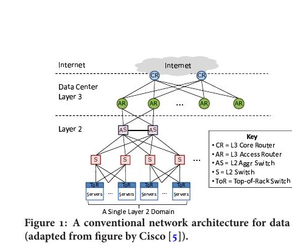
 
<b>图 1：传统数据中心网络的层次架构</b>（改编自 Cisco 图示）。包含 L3 核心路由器（CR）、L3 接入路由器（AR）、L2 汇聚交换机（AS）、L2 交换机（S）和机架顶部交换机（ToR）。

### 现有架构的三大根本局限

**服务器间容量有限**：上行链路从 ToR 到汇聚层通常被过度订阅 5:1 到 10:1，经过最高层的路径可能高达 1:240。

**资源碎片化**：服务器的 IP 地址由上层接入路由器拓扑决定，将服务扩展到单个二层域之外需要重新配置 IP 地址和 VLAN。

**可靠性和利用率差**：基本弹性模型是 1:1，每个设备和链路最多运行在最大利用率的 50%；生成树协议导致即使存在多条路径也只能使用一条。

---

## 3. 测量与启示

### 3.1 数据中心流量分析

对数据中心 NetFlow 和 SNMP 数据分析揭示：数据中心内服务器间流量与进出流量之比约为 4:1；网络是计算瓶颈，ToR 交换机上行链路利用率经常超过 75%。

### 3.2 流量分布分析

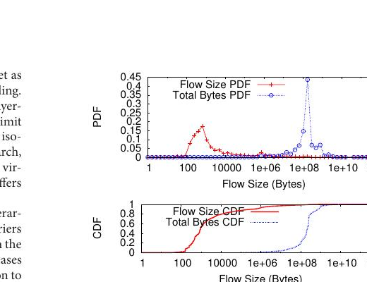
 
<b>图 2：小流数量众多；99% 的流小于 100 MB。然而超过 90% 的字节集中在 100 MB 到 1 GB 之间的流中。</b>

大多数流是小流（几 KB），是分布式文件系统的心跳包和元数据请求。数据中心几乎所有字节通过约 100 MB 到 1 GB 的流传输，约 100 MB 处的众数源于分布式文件系统将长文件拆分为 64 MB 块的设计。

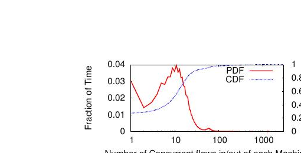
 
<b>图 3：并发连接数有两个众数：(1) 超过 50% 的时间约为 10 条，(2) 至少 5% 的时间超过 80 条。</b>

### 3.3 流量矩阵分析

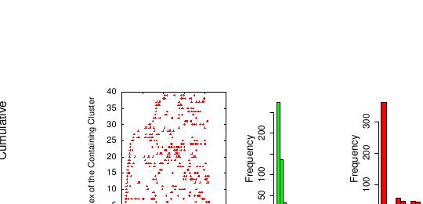
 
<b>图 4：流量矩阵所属的聚类快速随机变化，缺乏短期可预测性。</b>(a) 聚类索引随时间变化；(b) 运行长度分布；(c) 重复同一模式的时间间隔分布。

流量模式几乎持续变化，没有可预测的周期性，这说明 VLB 的随机化方法是应对流量波动性的最佳选择。

### 3.4 故障特征

通过超过一年的八个生产数据中心故障日志分析：
- 大多数故障规模较小（70% 涉及少于 2 台设备），但 0.3% 的故障会导致整个设备组的所有冗余组件同时失效；
- 停机时间可能很长：1.5% 的故障超过 1 天；
- 主要原因是网络错误配置、固件 Bug 和故障组件。

---

## 4. 虚拟二层网络

### 设计原则

- **通过随机化应对波动性**：使用 Valiant 负载均衡（VLB）进行与目的地无关的随机流量分散；
- **基于成熟网络技术构建**：使用商用交换机中已有的链路状态路由、ECMP、IP 任播和 IP 多播；
- **名称与定位符分离**：将服务器名称（应用特定地址 AA）与位置（位置特定地址 LA）分离；
- **拥抱终端系统**：在每台服务器网络栈中运行 VL 代理（垫片层），调用目录系统的解析服务。

### 4.1 横向扩展拓扑

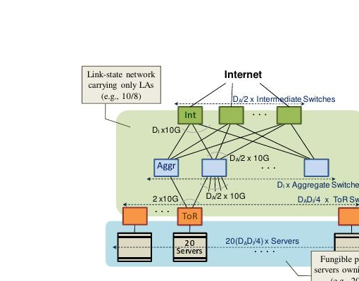
 
<b>图 5：汇聚交换机和中间交换机之间的 Clos 网络示例，为 VLB 提供了丰富连接的骨干网络。</b>网络使用两种不同的地址族——拓扑意义的位置地址（LA）和扁平的应用地址（AA）。

VL2 采用折叠 Clos 网络，中间交换机和汇聚交换机之间的链路构成完整的二部图。如果有 n 台中间交换机，其中任何一台故障仅将横截面带宽降低 1/n，实现优雅的带宽降级。路由极其简单：随机选取一条路径上行到随机中间交换机，再随机选取一条路径下行到目的 ToR 交换机。

### 4.2 VL2 寻址与路由

#### 4.2.1 地址解析与数据包转发

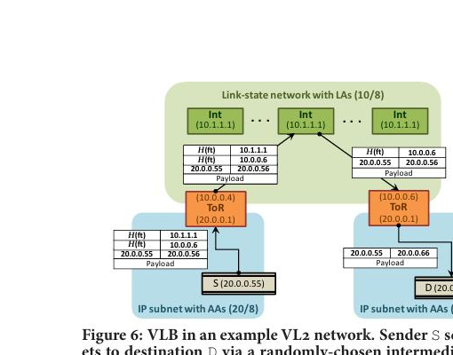
 
<b>图 6：VL2 网络中的 VLB 示意图。</b>发送方 S 通过随机选择的中间交换机，使用 IP-in-IP 封装将数据包发送给目的方 D。AA 来自 20/8 地址段，LA 来自 10/8 地址段。H(ft) 表示五元组的哈希值。

VL2 使用两种 IP 地址族：
- **位置特定地址（LA）**：网络基础设施使用，交换机运行链路状态路由协议仅传播这些 LA；
- **应用特定地址（AA）**：应用程序使用，无论服务器位置如何变化始终保持不变。

**数据包转发**：VL 代理捕获来自主机的数据包，将其封装为目的 ToR 的 LA 地址。数据包到达目的 ToR 后，交换机解封装并递送到目的 AA。

**地址解析**：VL 代理拦截 ARP 请求，将其转换为对 VL2 目录系统的单播查询，目录系统返回目的 ToR 的 LA 并缓存。

#### 4.2.2 跨多路径的随机流量分散

所有中间交换机被分配相同的任播 LA 地址，ECMP 负责将封装了任播地址的数据包递送到任何一台活跃的中间交换机，当发生故障时 ECMP 自动响应，无需通知代理。

### 4.3 VL2 目录系统

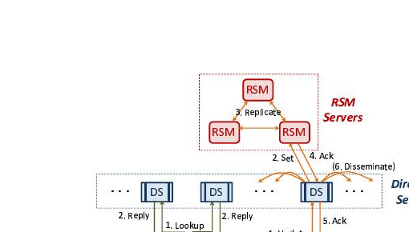
 
<b>图 7：VL2 目录系统架构。</b>包含复制状态机（RSM）服务器（提供强一致性存储）和目录服务器（DS，缓存 AA-to-LA 映射并处理代理查询）两层。

VL2 目录采用两层架构：
- **目录服务器**（约 K/100 台）：读优化、复制，缓存 AA 到 LA 的映射，处理 VL 代理的高频查询；
- **RSM 服务器**（3-5 台）：写优化，使用 Paxos 共识算法提供强一致性的可靠存储。

每台目录服务器每 30 秒从 RSM 惰性同步全量映射。代理向随机选择的 2 台目录服务器发送查询，选择最快的响应并缓存。

---

## 5. 评估

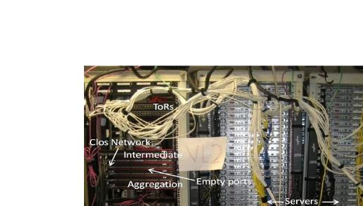
 
<b>图 8：由 80 台服务器和 10 台交换机组成的 VL2 测试台。</b>采用 Clos 拓扑，包含 3 台中间交换机、3 台汇聚交换机、4 台 ToR。

总体评估结果：(1) **94%** 的最优网络容量；(2) **Jain 公平性指数 0.995**；(3) 故障后优雅降级并快速重收敛；(4) **50K 次/秒、延迟低于 10ms** 的快速地址解析。

### 5.1 VL2 提供均匀高容量

**实验**：75 台服务器全对全数据混洗，每台向其余 74 台各传送 500 MB，总计 2.7 TB。

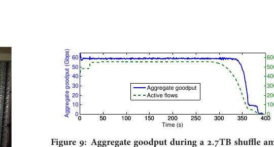
 
<b>图 9：75 台服务器进行 2.7TB 数据混洗时的聚合吞吐量（蓝色实线）和活跃流数（绿色虚线）随时间的变化。</b>

**结果**：VL2 在 395 秒内完成混洗，大部分时间聚合吞吐量为 **58.8 Gbps**，Jain 公平性指数 **0.995**，网络效率 **94%**。与传统 1:20 过度订阅的层次化设计相比，完成相同混洗只需约 1/11 的时间。

### 5.2 VL2 提供 VLB 公平性

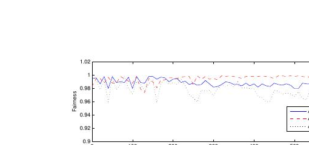
 
<b>图 10：公平性指标衡量流量在汇聚交换机到各中间交换机之间的均匀程度。</b>三条曲线分别对应 Aggr1、Aggr2、Aggr3，平均公平性指数超过 0.98。

### 5.3 VL2 提供性能隔离

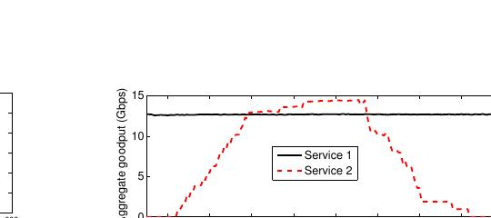
 
<b>图 11：两个服务器交错分布在 ToR 上的两个服务的聚合吞吐量。服务 2 的流量启停不影响服务 1 的吞吐量。</b>

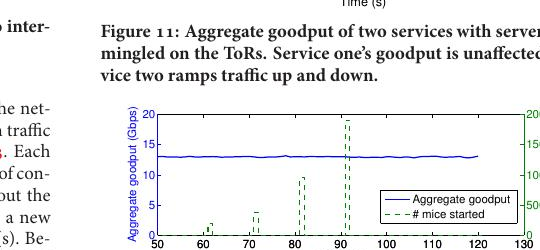
 
<b>图 12：服务 2 创建越来越多的突发短 TCP 连接时，服务 1 的聚合吞吐量（实线）依然保持稳定。</b>

**结论**：TCP 的自然 hose 模型强制执行结合 VLB 和无过度订阅网络，足以在服务间提供性能隔离。

### 5.4 VL2 链路故障后的收敛

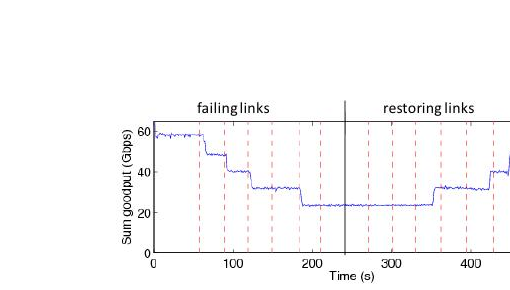
 
<b>图 13：所有到中间交换机 1 和 2 的链路被依次拔掉后再依次重新连接时的聚合吞吐量。每次故障后网络在 &lt; 1 秒内重收敛，并展示了优雅降级。</b>

**结果**：OSPF 在每次故障后快速重收敛（**亚秒级**）。VLB 和 ECMP 按预期工作，网络最大容量优雅降级。恢复因 OSPF 计时器保守默认值而延迟约 50 秒。

### 5.5 目录系统性能

1. 3 台目录服务器可在 10ms（第 99 百分位）内处理 **50K 次查询/秒**；
2. 3 台目录服务器可在 600ms 内处理 **12K 次更新/秒**；
3. 系统可增量扩展，每台目录服务器将查询处理速率提升约 17K 次/秒；
4. 对组件故障具有鲁棒性，在网络波动下提供高可用性。

---

## 6. 讨论

**VLB 最优性**：对比实验显示，对于最繁忙的链路，VLB 的链路容量使用比自适应路由高约 30%，但与复杂流量工程相比仅消耗相对较少的额外容量。

**成本与规模**：使用 144 端口交换机（$14,000/台）可连接 25,000 台服务器；无过度订阅 VL2 网络与当前 1:80 过度订阅网络成本相当；构建无过度订阅的传统网络则需约 3 倍成本。

---

## 7. 相关工作

- **Monsoon / Fat-tree**：同样用商用交换机和 Clos 拓扑，但 Monsoon 重新发明了二层已有的容错路由机制，Fat-tree 依赖尚不存在于商用交换机的定制路由原语；
- **DCell / BCube**：通过在服务器上添加多个网络接口构建互连网络；
- **LISP**：提出"映射与封装"实现 Internet 路由可扩展性，VL2 控制平面采用类似方法并针对数据中心适配；
- **SEATTLE**：在交换机上运行分布式主机信息解析系统，VL2 采用终端主机方案，可使用现有任何交换机。

---

## 8. 总结

VL2 是一种新型网络架构，终结了数据中心网络中对过度订阅的需求。

**关键技术总结**：
- 折叠 Clos 拓扑 + VLB（随机路由）= 无热点、均匀高容量；
- AA/LA 名址分离 + 目录系统 = 二层语义 + 虚拟机可迁移；
- TCP 端到端拥塞控制 + VLB = 服务间性能隔离无需准入控制；
- OSPF 快速重收敛 + ECMP = 链路故障后亚秒级恢复，优雅降级。

使用商用交换机构建的原型：全对全数据混洗持续效率 **94%**，TCP 公平性指数 **0.995**。

---

*翻译整理自原文（SIGCOMM 2009），图片提取自原 PDF，如有出入请以英文原文为准。*
